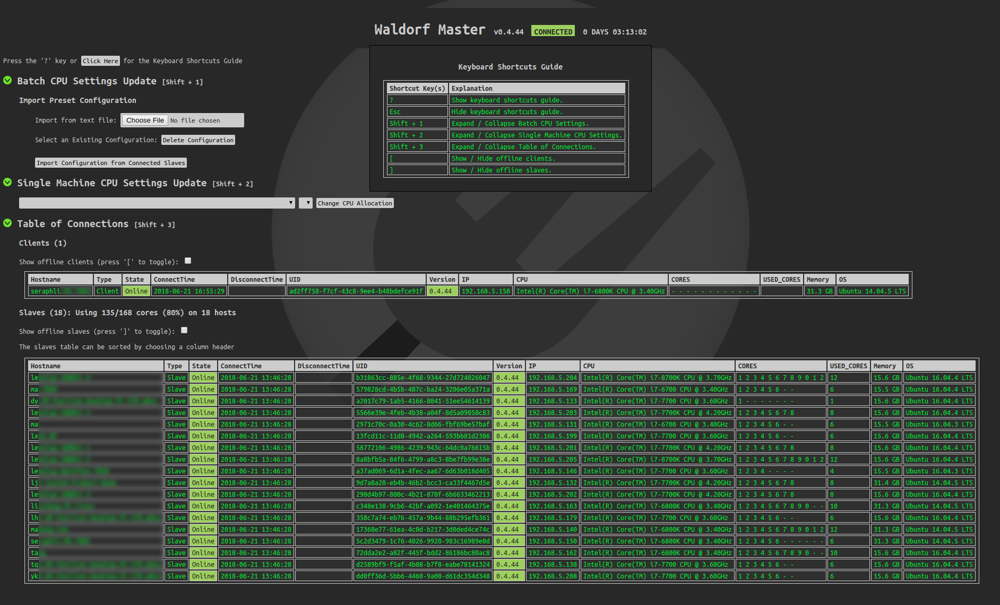

# 

Waldorf is an efficient, parallel task execution framework written in Python.
It was developed for research into [reinforcement learning](https://en.wikipedia.org/wiki/Reinforcement_learning)
algorithms at [our startup company](http://www.levelup.ai/) in Beijing, China.

Waldorf is based on the [Celery distributed task queue](https://github.com/celery/celery),
and takes its name from [Waldorf salad](https://en.wikipedia.org/wiki/Waldorf_salad),
which also has celery as an ingredient.

It can speed up algorithms such as [Monte Carlo Tree Search (MCTS)](https://en.wikipedia.org/wiki/Monte_Carlo_tree_search) by
spreading concurrent sub-tasks, written as Python functions, across multiple
machines and automating the collection of outputs. Waldorf can also be used
to implement MapReduce-style work-flows.

Although Waldorf can be deployed on cloud servers, our emphasis at the moment
is on utilizing the spare CPU capacity of a commodity PC cluster (e.g. normal
office workstations). Support for GPUs may be included in a future release.

## Features

1. Waldorf uses a master node to pass messages between a client and
slave nodes.

2. A client can create a task as a Python function on his or her local machine.
Waldorf sends tasks to a network of slave machines for execution using the
Celery task queue. When Celery is used on its own, tasks typically must be
defined in advance, but Waldorf allows tasks to be defined dynamically
without any slave restarts required.

3. Multiple clients can run their tasks simultaneously without conflict.

4. Clients can adjust how many CPU cores are used on slave machines to
perform calculations. This can be done dynamically from the Waldorf
administration webpage.



## Basic Usage

You can use Waldorf on any task that requires parallel computing.

One of its many uses is to compute rollouts in an MCTS simulation (for
example, in game-playing AIs).

Here is a simple illustration:

```python
def rollout(args):
    # Do one rollout
    ...

def backup(result):
    # Backup and handle result
    ...

def mcts_search():
    for _ in range(iter):
        # Select action
        action = select()
        ...
        # Submit rollout job to waldorf client
        client.submit(rollout, args, callback=backup)
        ...
    # More code
    ...
```

For a more complex example, check out [the gym demo](example/gym_demo.py).

## Quick Start

Install Waldorf using [the installation guide](docs/installation.md) and
check out [the gym demo](example/gym_demo.py).

## Disclaimer

Waldorf is still research code, so it may be slightly lacking in terms of
documentation and support. Any feedback is welcomed.
